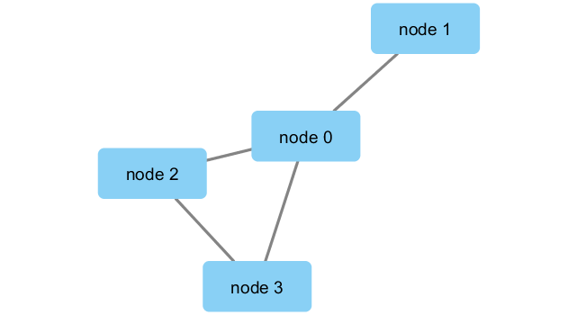
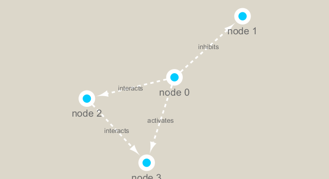

```{r setup, include=FALSE}
knitr::opts_chunk$set(echo = TRUE)
```

- CRAN's "igraph" package (`install.packages("igraph")`)
- bioconductor's "RCy3" package (`BiocManager::install("RCy3")`)

```{r}
library(RCy3)
```

Check that we can talk to cytoscape from R. Note that cytoscape must be running at this point.
```{r}
cytoscapePing()
```

We can test things further by making a small network (here in igraph format as used by the R igraph package) and sending it to Cytoscape:
```{r}
g <- makeSimpleIgraph()
createNetworkFromIgraph(g,"myGraph")
# if you go onto Cytoscape, you should see the data

# this saves the image file
fig <- exportImage(filename="demo", type="png", height=350)
# this exports it to show up onto your Rmd file here

```

## Changing styles
```{r}
setVisualStyle("Marquee")
```

```{r}
fig <- exportImage(filename="demo_marquee", type="png", height=350)

```

You can plot your igraph objects into R itself.
```{r}
plot(g)
```

# Read out metagenomics data
- Data comes frmo TARA oceans studies
```{r}
## scripts for processing located in "inst/data-raw/"
# notice this is NOT .csv, so do NOT use read.csv
prok_vir_cor <- read.delim("virus_prok_cor_abundant.tsv", stringsAsFactors = FALSE)

## Have a peak at the first 6 rows
head(prok_vir_cor)
```
How many rows/connections (i.e., edges) will we have in our network?
```{r}
nrow(prok_vir_cor)
```

Use the igraph function to make a network from this data.frame:
```{r}
# MAKE SURE TO LOAD igraph PACKAGE BEFORE USING igraph FUNCTION.
library(igraph)
# directed = F makes it NOT DIRECTED (thus, we don't know the flow)
g2 <- graph.data.frame(prok_vir_cor, directed = FALSE)
plot(g2)

```

### A MESS: Let's turn some features off with some arguments.

- Make nodes/vertex smaller. Turn off the blue text labels. 
```{r}
plot(g2, vertex.size = 3, vertex.label=NA)
```

To send this network to cytoscape, we can use the command:
```{r}
createNetworkFromIgraph(g2,"myIgraph")
```

## Network community detection
- Community structure detection algorithms try to find dense sub-graphs within larger network graphs (i.e. clusters of well connected nodes that are densely connected themselves but sparsely connected to other nodes outside the cluster).
- Here we use the classic Girvan & Newman betweenness clustering method.

- goes thru networks, find edges and shortest paths btw networks and deletes them
- calculates them
- looks for peak of that value

```{r}
cb <- cluster_edge_betweenness(g2)
cb
plot(cb, y=g2, vertex.label=NA,  vertex.size=3)
```

## Centrality analysis
- Centrality gives an estimation on *how important a node or edge is* for the connectivity (or the information flow) of a network. 
- It is a particularly useful parameter in signaling networks and it is often used when trying to find drug targets for example.
```{r}
pr <- page_rank(g2)
head(pr$vector)
```

BBmisc is a CRAN package (`install.packages("BBmisc")`)
```{r}
# Make a size vector btwn 2 and 20 for node plotting size

v.size <- BBmisc::normalize(pr$vector, range=c(2,20), method="range")
plot(g2, vertex.size=v.size, vertex.label=NA)
```

